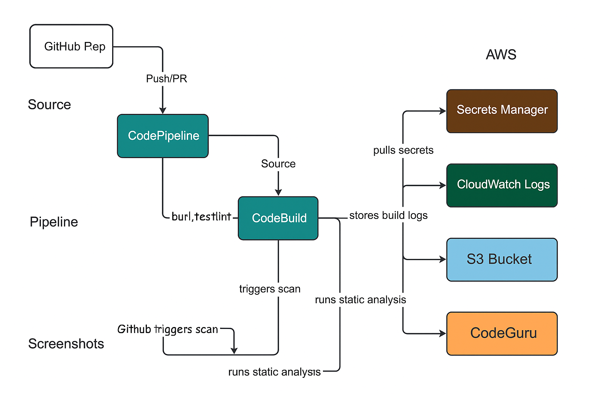

# AWS Security CI/CD Lab

Implemented a secure AWS CI/CD pipeline using CodePipeline, CodeBuild, and GitHub integration.
The project emphasizes security best practices such as least-privilege IAM, secrets management, MFA, CloudWatch logging, static analysis, and automated testing to ensure safe and reliable software delivery.

---

## Table of Contents

- [Overview]
- [Real-World Risk]
- [What I Built]
- [Diagram]
- [Objectives]
- [Steps Performed]
  - [1. IAM setup]
  - [2. GitHub integration]
  - [3. CodeBuild project creation]
  - [4. Pipeline setup]
  - [5. Logging to CloudWatch]
  - [6. Security checks]
  - [7. Cleanup]
- [CI/CD Pipeline Stages]
- [Security Features Implemented]
- [Screenshots & Deliverables]
- [Troubleshooting & Common Errors]
- [Lessons Learned]
- [Future Improvements]
- [References]

---

## Overview

A hands-on lab demonstrating secure CI/CD automation in AWS, including CodeBuild, CodePipeline, static analysis, secret management, CloudWatch logging, and secure IAM practices.

---

## Real-World Risk

Without secure CI/CD practices, organizations risk exposing sensitive credentials, deploying untested or vulnerable code, and granting excessive permissions to automated systems. Attackers can exploit misconfigured pipelines to gain unauthorized access, inject malicious code, or pivot through compromised build environments. Failing to mask secrets in logs, neglecting static analysis, or skipping IAM least-privilege can quickly turn automation into an enterprise-wide vulnerability.

---

## What I Built

- Integrated GitHub with AWS CodePipeline and CodeBuild for fully automated builds.
- Configured IAM roles using least-privilege and enabled MFA for administrative access.
- Secured pipeline secrets using AWS Secrets Manager with environment variable injection and log masking.
- Automated test execution and generated coverage reports using pytest.
- Implemented static code analysis using Pylint and AWS CodeGuru Reviewer.
- Centralized build logs in Amazon CloudWatch for troubleshooting and audit trails.
- Encrypted all artifacts at rest in Amazon S3.

---

## Diagram

---

## Objectives

- Automate CI/CD with security best practices.
- Integrate GitHub, CodeBuild, CodePipeline.
- Enforce IAM, MFA, secret management, and logging.
- Apply static code analysis.

---

## Steps Performed

1. IAM User, Roles & MFA Setup
   - Created a dedicated IAM user for lab work, enabled MFA for extra security (Screenshot: iam-user-mfa-enabled.png)
   - Defined and attached least-privilege IAM policies for CodeBuild and CodePipeline roles, including trusted entities. (Screenshots: iam-role-codebuild-permissions.png, iam-role-codepipeline-permissions.png, iam-role-codebuild-trusted-entities.png & iam-role-codepipeline-trusted-entities.png)

2. GitHub Integration & Source Connection
   - Linked GitHub repository with AWS CodePipeline for automated source pulls. (Screenshots: github-repo-initial-setup.png & codebuild-github-token-connected.png)

3. S3 Bucket Creation & Encryption
   - Created an S3 bucket for artifact storage and enabled default encryption (Screenshots: s3-bucket-created.png & s3-bucket-encryption.png)

4. Secrets Management with AWS Secrets Manager
   - Created a secret in AWS Secrets Manager to securely inject sensitive environment variables into builds (Screenshot: secretsmanager-create-secret.png)

5. CodeBuild Project Setup & Environment Configuration
   - Configured a CodeBuild project specifying environment variables, secret retrieval and compute resources (Screenshots: codebuild-project-details.png, codebuild-project-environment.png & codebuild-secrets-env-var.png)

6. CI/CD Pipeline Creation and Source Stage
   - Set up a CodePipeline pipeline with source (GitHub), build (CodeBuild), and test/reporting stages (Screenshot: codepipeline-source-setup.png)
   - Verified pipeline triggers on new commits (Screenshot: codepipeline-run-success.png)

7. Build, Test & Static Analysis Integration
   - Configured the buildspec to run Python tests with pytest and code linting with pylint or similar tools.
   - Captured and published test and linting results to the console and CodeBuild reports (Screenshots: codebuild-build-success.png, codebuild-test-report-success.png, codebuild-test-report-summary.png & static-analysis-linting.png)

8. Logging and Monitoring
   - Verified all build logs are streamed to AWS CloudWatch for visibility and auditing (Screenshots: cloudwatch-log-groups-list.png & cloudwatch-codebuild-log-stream.png)

9. Secret Masking & Security Validation
   - Confirmed that sensitive secrets (e.g., from Secrets Manager) are masked and not exposed in logs (Screenshot: codebuild-secret-print-log.png)

10. Automated Code Scanning (Bonus)
   - Integrated AWS CodeGuru Reviewer for automated static code analysis and recommendations (Screenshot: codeguru-scan-results.png)

11. Cleanup
   - Deleted all created AWS resources (IAM roles, S3 bucket, CodeBuild projects, CodePipeline, Secrets Manager secrets) to avoid ongoing costs.

---

## CI/CD Pipeline Stages

| Stage           | Description                                          |
|-----------------|------------------------------------------------------|
| Source          | Connect to GitHub repo                               |
| Build           | Build/test with CodeBuild, print secret (redacted)   |
| Test            | Pytest reports and test summary                      |
| Static Analysis | Pylint and CodeGuru Reviewer                         |
| Artifact        | Upload build/test reports to S3 (if applicable)      |
| Logging         | All build logs to CloudWatch                         |

---

## Security Features Implemented

- IAM Least Privilege custom service roles.
- MFA Enabled for user.
- Secrets Manager for build environment variables.
- CloudWatch Logs for all build phases.
- Static Analysis with pylint and CodeGuru.
- S3 Bucket Encryption (for artifacts)
- Source Control with GitHub and protected tokens.

---

## Screenshots & Deliverables

*All screenshots are included in the screenshots/ folder.

| Order | File Name                                  | What it Shows                                                   |
| ----- | -------------------------------------------|---------------------------------------------------------------- |
| 1     | cloudwatch-codebuild-log-stream.png        | CloudWatch log stream for CodeBuild                             |
| 2     | cloudwatch-log-groups-list.png             | List of CloudWatch log groups                                   |
| 3     | codebuild_test_report_success.png          | CodeBuild test report: successful run                           |
| 4     | codebuild-build-success.png                | CodeBuild project: successful build                             |
| 5     | codebuild-github-token-connected.png       | GitHub account connected to CodeBuild                           |
| 6     | codebuild-project-details.png              | CodeBuild project details page                                  |
| 7     | codebuild-project-environment.png          | CodeBuild environment settings                                  |
| 8     | codebuild-secret-print-log.png             | CodeBuild log: secret value (redacted) printed in logs          |
| 9     | codebuild-secrets-env-var.png              | Environment variable setup for secrets in CodeBuild             |
| 10    | codebuild-test-report-summary.png          | CodeBuild test report summary                                   |
| 11    | codeguru-scan-results.png                  | CodeGuru static analysis/linting results                        |
| 12    | codepipeline-run-success.png               | CodePipeline run: overall success status                        |
| 13    | codepipeline-source-setup.png              | CodePipeline source (GitHub) setup                              |
| 14    | github-repo-initial-setup.png              | Initial setup of GitHub repository                              |
| 15    | iam-role-codebuild-permissions.png         | IAM permissions for CodeBuild role                              |
| 16    | iam-role-codebuild-trusted-entities.png    | Trusted entities for CodeBuild IAM role                         |
| 17    | iam-role-codepipeline-permissions.png      | IAM permissions for CodePipeline role                           |
| 18    | iam-role-codepipeline-trusted-entities.png | Trusted entities for CodePipeline IAM role                      |
| 19    | iam-user-mfa-enabled.png                   | MFA enabled for IAM user                                        |
| 20    | s3-bucket-created.png                      | S3 bucket created for CodeBuild artifacts                       |
| 21    | s3-bucket-encryption.png                   | S3 bucket encryption settings                                   |
| 22    | secretsmanager-create-secret.png           | Secret creation in AWS Secrets Manager                          |
| 23    | static-analysis-linting.png                | Static analysis/linting results (could also reference CodeGuru) |

---

## Troubleshooting & Common Errors

- GitHub not connected: Reconnect source credentials under "Account settings > Credentials".
- AccessDenied for Secrets Manager: Attach correct permissions to CodeBuild role.
- YAML_FILE_ERROR: Double-check your `buildspec.yml` syntax.
- pip install errors: Ensure your `requirements.txt` matches your runtime.

---

## Lessons Learned

- Automating secrets handling eliminates hardcoding risks.
- Static analysis catches code issues early in the pipeline.
- Least-privilege IAM roles are critical for build security.
- CloudWatch logs make debugging much easier.

---

## Future Improvements

- Integrate CodePipeline for multi-stage deployments.
- Add Snyk or Bandit for deeper Python security checks.
- Use fine-grained GitHub tokens and OIDC federation.

---

## References

- AWS CodeBuild Documentation
  https://docs.aws.amazon.com/codebuild/

- AWS CI/CD Security Best Practices
  https://docs.aws.amazon.com/prescriptive-guidance/latest/patterns/implement-secure-ci-cd-on-aws.html

- pytest
  https://docs.pytest.org/en/7.1.x/

- pylint
  https://pylint.pycqa.org/en/latest/

- AWS CodeGuru Reviewer
  https://docs.aws.amazon.com/codeguru/latest/reviewer-ug/welcome.html

---

Sebastian Silva C. - July, 2025 - Berlin, Germany

